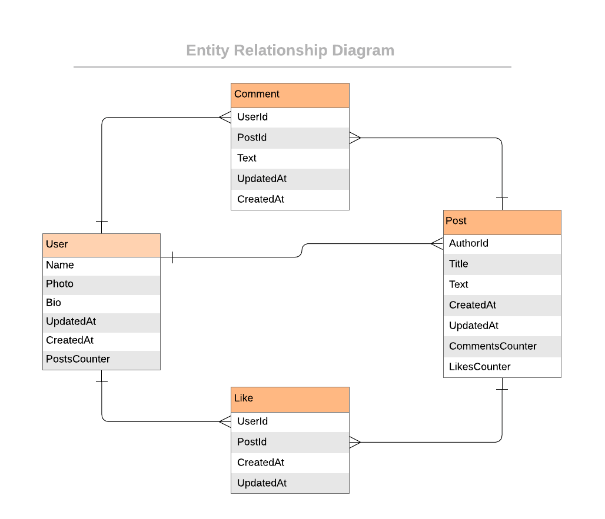

<a name="readme-top" align="center"></a>

<div align="center">
  <h1>Blog App</h1>
  <br/>

</div>

<!-- TABLE OF CONTENTS -->

# 📗 Table of Contents

- [📖 About the Project](#about-project)
  - [🛠 Built With](#built-with)
    - [Tech Stack](#tech-stack)
    - [Key Features](#key-features)
  - [🚀 Live Demo](#live-demo)
- [💻 Getting Started](#getting-started)
  - [Setup](#setup)
  - [Prerequisites](#prerequisites)
  - [Install](#install)
  - [Usage](#usage)
  - [Run tests](#run-tests)
  <!-- - [Deployment](#triangular_flag_on_post-deployment) --> 
- [👥 Authors](#authors)
<!-- - [🔭 Future Features](#future-features) -->
- [🤝 Contributing](#contributing)
- [⭐️ Show your support](#support)
- [🙏 Acknowledgements](#acknowledgements)
- [📝 License](#license)

<!-- PROJECT DESCRIPTION -->

# 📖 Blog App <a name="about-project"></a>
Blog App is classic blog app that allows users to create posts and add comments to them. It also allows users to like posts. It is built using Ruby on Rails.

## 🛠 Built With <a name="built-with"></a>

### Tech Stack <a name="tech-stack"></a>

<details>
  <summary>Server</summary>
  <ul>
    <li><a href="https://www.ruby-lang.org/en/">Ruby</a></li>
  </ul>
</details>

<details>
  <summary>Database</summary>
  <ul>
    <li><a href="https://www.postgresql.org/">PostgreSQL</a></li>
  </ul>
</details>

<!-- Features -->

### Key Features <a name="key-features"></a>
- Create a comment
- Create a post
- Create a like
- Create a user

<p align="right">(<a href="#readme-top">back to top</a>)</p>

<!-- LIVE DEMO -->
## 🚀 Live Demo <a name="live-demo"></a>
Not Deployed Yet.


### UML Diagram
 <div align="center">
  
 </div>


<p align="right">(<a href="#readme-top">back to top</a>)</p>

<!-- GETTING STARTED -->

## 💻 Getting Started <a name="getting-started"></a>

To get a local copy up and running, follow these steps.

### Prerequisites
In order to run this project you need:

- To install ruby on your PC. You can read [this](https://rubyinstaller.org/downloads/) documentation on how to do so
- To install sqlite3 on your PC. You can read [this](https://www.sqlite.org/download.html) documentation on how to do so
- Know how to navigate directories or folders at the CLI.
- Know how to get the URL(https/ssh) of a repository on GitHub.
- You should have a code editor installed, preferably VSCode.
- In order to run this project you need:

### Setup
In desired folder or directory in the CLI, run the command:

```sh
git clone git@github.com:elarhadu/Blog-App.git
```

Navigate into the cloned folder or repository by running the command:
```sh
cd Blog-App
```

If VsCode is your default code editor, run:
```sh
code .
```

You are all set up!
### Install

Install this project with:

```sh
 bundle install
``` 
### Usage

To run the project, execute the following command:

```sh
ruby bin/rails server
```

### Run tests

To run tests, run the following command:

```sh
  rspec spec spec/[filename.rb]
```

<!-- ### Deployment

You can deploy this project using:

```sh

```  -->

<p align="right">(<a href="#readme-top">back to top</a>)</p>

<!-- AUTHORS -->

## 👥 Author <a name="authors"></a>


👤 **Emmanuella Adu**

- GitHub: [@elarhadu](https://github.com/elarhadu)
- Twitter: [@elarh\_](https://twitter.com/elarh_)
- LinkedIn: [Emmanuella Adu](https://linkedin.com/in/emmanuella-adu)


<p align="right">(<a href="#readme-top">back to top</a>)</p>

<!-- FUTURE FEATURES -->

## 🔭 Future Features <a name="future-features"></a>
- Create Post 
- Add Comment to a post 
- Like a Post 

<p align="right">(<a href="#readme-top">back to top</a>)</p>

<!-- CONTRIBUTING -->

## 🤝 Contributing <a name="contributing"></a>

Contributions, issues, and feature requests are welcome!

Feel free to check the [issues page](https://github.com/elarhadu/Blog-App/issues).

<p align="right">(<a href="#readme-top">back to top</a>)</p>

<!-- SUPPORT -->

## ⭐️ Show your support <a name="support"></a>

If you like this project give me ⭐

<p align="right">(<a href="#readme-top">back to top</a>)</p>

<!-- ACKNOWLEDGEMENTS -->

## 🙏 Acknowledgments <a name="acknowledgements"></a>

I would like to thank [Microverse](https://github.com/microverseinc) for this project inspiration.

<p align="right">(<a href="#readme-top">back to top</a>)</p>

<!-- LICENSE -->

## 📝 License <a name="license"></a>

This project is [MIT](./LICENSE) licensed.


<p align="right">(<a href="#readme-top">back to top</a>)</p>
